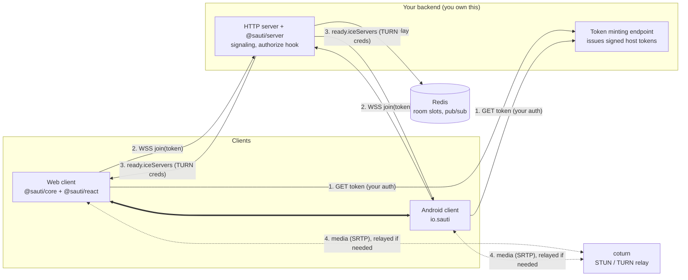
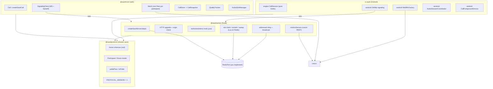
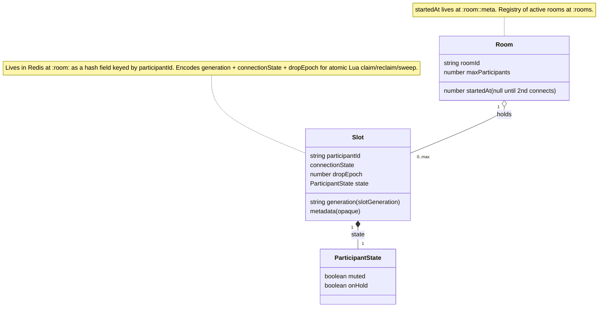
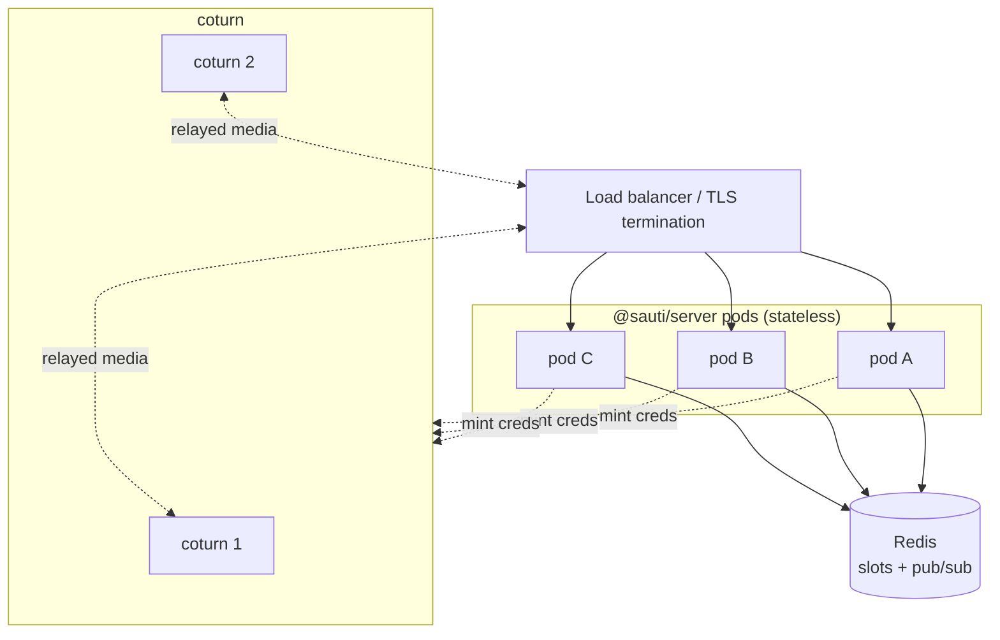
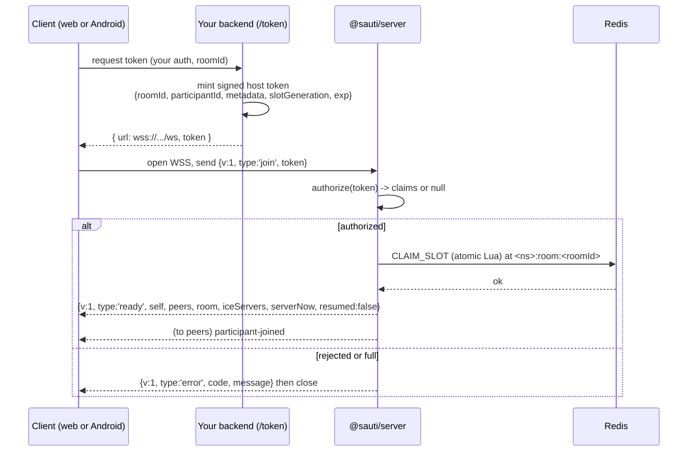
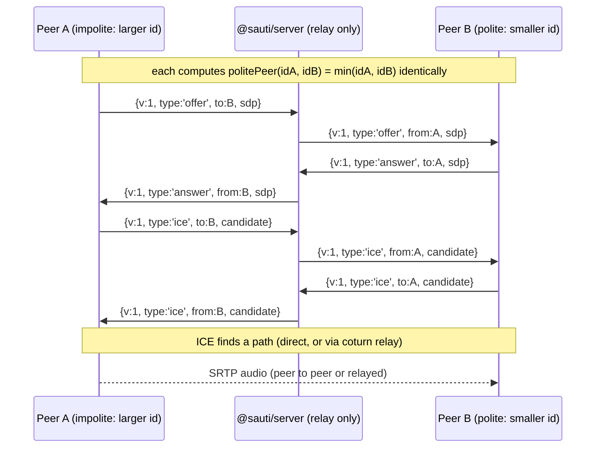
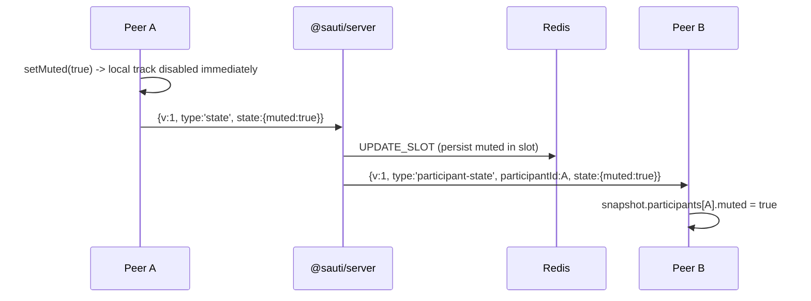
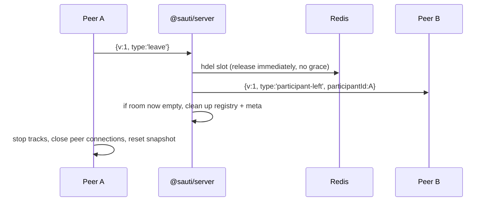

# Sauti integration guide

This is the end-to-end guide for standing up an internet audio calling system with
the Sauti libraries. It is generic. It assumes no particular company, product, cloud,
or framework. Where a value is not fixed by the code, this guide states a sensible
default and says so.

Sauti (Swahili for "voice") is a self-hosted, domain-agnostic multi-party audio
calling stack. It gives you a WebRTC audio mesh, a signaling server you attach to your
own HTTP server, a web client, an Android client, and one frozen wire contract that
all of them speak. It has no concept of a user, a role, a trip, a driver, or a
passenger. It has participants, rooms, and an opaque metadata bag that you own.

The authoritative source for the wire protocol is `CONTRACT.md` in the repository
root. If this guide and `CONTRACT.md` ever disagree, `CONTRACT.md` wins.

## Contents

1. Overview and architecture
2. Backend engineer: the signaling server
3. Frontend engineer: `@sauti/core` and `@sauti/react`
4. Mobile engineer: `io.sauti` on Android
5. DevOps: coturn, Redis, configuration, scaling
6. End to end: one call, start to finish
7. API reference tables
8. Notes, gaps, and defaults

---

## 1. Overview and architecture

### What Sauti is

- **A mesh, not an SFU.** Every participant holds one `RTCPeerConnection` to every
  other participant. Audio flows peer to peer. The server never touches media. This is
  simple and low-latency but does not scale in participant count: the number of
  connections per participant grows linearly, and each client encodes its microphone
  once per peer. The mesh is only sane to about three participants. The default room
  cap is 3.
- **Perfect negotiation, role-free.** There is no "caller always offers" rule. Each
  pair of peers runs WebRTC perfect negotiation. Which side is polite is decided by
  comparing the two `participantId` strings: the lexicographically smaller id is the
  polite peer (it rolls back on a collision), the larger is impolite (it wins). Every
  client computes this identically with no server round-trip. Web and Android
  implement the exact same comparison (`a <= b ? a : b`), so a browser peer and an
  Android peer interoperate.
- **Opaque identity.** The library never mints or inspects identity. The host issues a
  token. The server decodes it through a hook you supply into a `roomId`, a
  `participantId`, an optional `metadata` bag, and a `slotGeneration`. The
  `participantId` and `roomId` are opaque strings to Sauti. The `metadata` bag is
  host-owned: the library stores it, diffs it, ships it to peers, and never reads a
  key. Put a display name, a seat kind, an avatar URL, or anything else in there.
- **Server-anchored call duration.** The room clock starts once, when the second
  participant connects. The server stamps `startedAt` (epoch ms) and every client
  computes elapsed time as `(now + clockOffset) - startedAt`, where `clockOffset =
  serverNow - localNow` is measured once from the `ready` frame. Because it is
  anchored to the server, duration survives reconnects and process death. It is never
  a local stopwatch.
- **Reconnect and grace.** A dropped socket does not release the room slot. The server
  marks the participant `unreachable`, tells the peers, and holds the slot for a grace
  window (default 30000 ms). A reconnect within the window that presents a token whose
  `slotGeneration` matches reclaims the same slot and gets a `ready` with
  `resumed: true`. Grace expiry releases the slot and announces a real leave. The
  reclaim is a single atomic Redis operation, so a grace sweep and a resume can never
  both win.
- **TURN via coturn.** NAT traversal uses STUN/TURN. The server mints short-lived
  TURN credentials with the coturn REST scheme (an HMAC over an expiry timestamp) and
  ships them to the client inside `ready.iceServers`. The TURN static-auth secret
  never leaves the server.

### High-level architecture



The dashed line to coturn is the fallback path taken only when a direct peer-to-peer
connection cannot be established. When peers can reach each other directly, media does
not transit coturn.

### Low-level components



### The object model

From `CONTRACT.md`. This is what everything below is built on.

```
Participant {
  participantId: string            opaque, host-supplied via the authorize hook
  joinedAt: number                 epoch ms, server-stamped
  metadata: Record<string, Json>   host-owned; stored and diffed, never inspected
  connectionState: 'connecting' | 'connected' | 'reconnecting' | 'unreachable' | 'left'
  state: { muted: boolean; onHold: boolean }
}

Room {
  roomId: string                   opaque, host-supplied
  participants: Map<participantId, Participant>
  metadata: Record<string, Json>
  maxParticipants: number          host-configured; default 3
  startedAt: number | null         epoch ms, set when the 2nd participant connects
}
```

There is no `role` field anywhere in the library. If you need the notion of a seat
kind, put it in `metadata`.

### The data and state model



---

## 2. Backend engineer: the signaling server

`@sauti/server` is a framework-agnostic signaling library. It does not open a port of
its own. You give it dependencies, and it attaches a WebSocket handler to an HTTP
server you already run. It has three responsibilities: authorize joins, keep room slot
state in Redis, and relay the WebRTC negotiation frames between peers. It never sees
or touches media.

### What you must supply

`createSautiServer(deps)` takes a `CreateServerDeps` object:

| Field | Type | Required | Meaning |
|---|---|---|---|
| `redis` | `RedisPort` | yes | Your adapter over a Redis client. Interface below. |
| `turn` | `TurnConfig` | yes | coturn URLs, static-auth secret, credential TTL, optional realm. |
| `authorize` | `AuthorizeFn` | yes | Decodes a token into `{ roomId, participantId, metadata?, slotGeneration? }` or `null`. |
| `namespace` | `string` | yes | Prefixes every Redis key and pub/sub channel. Non-empty. |
| `maxParticipantsPerRoom` | `number` | no | Default 3. |
| `graceMs` | `number` | no | Reconnect grace window. Default 30000. |
| `allowedOrigins` | `string[]` | no | If set, the WS upgrade Origin must be in this list. |
| `requireOrigin` | `boolean` | no | Default true. Reject an upgrade with no Origin header. |
| `onEvent` | `EventSink` | no | Structured operational events. Never carries host-domain data. |
| `rateLimiter` | `RateLimiter` | no | Per-IP connect and per-participant frame limits. |

It returns:

```ts
interface SautiServer {
  attach(httpServer: http.Server, opts?: { path?: string }): void;
  listActiveRooms(): Promise<Array<{
    roomId: string; participantCount: number; participantIds: string[]; startedAt: number | null;
  }>>;
  close(): Promise<void>;
}
```

`attach` registers an `upgrade` listener on your HTTP server. If you pass
`opts.path`, only WebSocket upgrades to that exact pathname are accepted; everything
else gets a 404. This path is the signaling path. There is no environment variable or
built-in constant for it; you choose it (for example `/ws` or `/sauti/signal`) and you
tell your clients the same value. Whatever path you attach at is the path clients
connect to.

### The RedisPort interface

Sauti does not import a Redis client. You implement this thin port over whatever client
you use. The server needs hash operations, `pexpire`, `eval` (for the atomic slot Lua
scripts), and pub/sub. Pub/sub is what lets two peers on two different server
processes still reach each other.

```ts
interface RedisPort {
  hsetnx(key: string, field: string, value: string): Promise<0 | 1>;
  hget(key: string, field: string): Promise<string | null>;
  hgetall(key: string): Promise<Record<string, string>>;
  hdel(key: string, field: string): Promise<void>;
  pexpire(key: string, ms: number): Promise<void>;
  eval(script: string, keys: string[], args: string[]): Promise<unknown>;
  publish(channel: string, message: string): Promise<void>;
  subscribe(channel: string, handler: (message: string) => void): Promise<void>;
  unsubscribe(channel: string, handler: (message: string) => void): Promise<void>;
}
```

A working adapter over `ioredis`. Note that a Redis connection in subscriber mode
cannot issue normal commands, so you need two connections: one for commands, one for
subscriptions.

```ts
import Redis from 'ioredis';
import type { RedisPort } from '@sauti/server';

export function createRedisPort(host = '127.0.0.1', port = 6379): {
  port: RedisPort;
  close(): Promise<void>;
} {
  const commander = new Redis(port, host);
  const subscriber = new Redis(port, host);
  const handlers = new Map<string, Set<(message: string) => void>>();

  subscriber.on('message', (channel: string, message: string) => {
    for (const handler of handlers.get(channel) ?? []) handler(message);
  });

  const redis: RedisPort = {
    async hsetnx(key, field, value) {
      return (await commander.hsetnx(key, field, value)) as 0 | 1;
    },
    async hget(key, field) {
      return commander.hget(key, field);
    },
    async hgetall(key) {
      return commander.hgetall(key);
    },
    async hdel(key, field) {
      await commander.hdel(key, field);
    },
    async pexpire(key, ms) {
      await commander.pexpire(key, ms);
    },
    async eval(script, keys, args) {
      return commander.eval(script, keys.length, ...keys, ...args);
    },
    async publish(channel, message) {
      await commander.publish(channel, message);
    },
    async subscribe(channel, handler) {
      let set = handlers.get(channel);
      if (!set) {
        set = new Set();
        handlers.set(channel, set);
        await subscriber.subscribe(channel);
      }
      set.add(handler);
    },
    async unsubscribe(channel, handler) {
      const set = handlers.get(channel);
      if (!set) return;
      set.delete(handler);
      if (set.size === 0) {
        handlers.delete(channel);
        await subscriber.unsubscribe(channel);
      }
    }
  };

  return {
    port: redis,
    async close() {
      await Promise.all([commander.quit(), subscriber.quit()]);
    }
  };
}
```

### The authorize hook and the host token

This is the security boundary you own. The library never mints or inspects identity.
A client opens the WebSocket, sends `{ v:1, type:'join', token }`, and the server
calls your `authorize(token)`. You decode the token and return the claims, or `null`
to reject.

```ts
type AuthorizeFn = (token: string) => Promise<{
  roomId: string;
  participantId: string;
  metadata?: Record<string, unknown>;
  slotGeneration?: string | number;
} | null>;
```

The same token is presented on a first join and on a reconnect. `CONTRACT.md` calls
this the "extended join token": one artifact, with extra claims, not a second token.
The claims the host puts in it are:

- `roomId`: which room this participant joins. Opaque to Sauti.
- `participantId`: the participant's opaque, stable id. It is used for slot ownership,
  for TURN credential derivation, and for perfect-negotiation politeness. It must be
  stable across a reconnect for the resume to work.
- `metadata` (optional): your host-owned bag. A display-name convention is to put it
  under a key such as `metadata.name`. The library ships this untouched to every peer.
- `slotGeneration` (optional, default `'0'`): a value that identifies this
  occupancy of the slot. A reconnect must carry the same `slotGeneration` as the
  original join to reclaim the same slot. If you issue a genuinely new session for the
  same participant in the same room, bump the generation so the old slot is not
  reclaimed by the new session.
- `exp` (recommended): an expiry you enforce inside `authorize`. Sauti does not check
  token expiry; you do.

You choose the token format. A signed JWT is the natural choice because it lets
`authorize` verify integrity and expiry without a database round-trip. A minimal
example with `jsonwebtoken`:

```ts
import jwt from 'jsonwebtoken';
import type { AuthorizeFn } from '@sauti/server';

const TOKEN_SECRET = process.env.SAUTI_TOKEN_SECRET!;

// Called by your own application, behind your own auth, to hand a client a token.
export function mintHostToken(input: {
  roomId: string;
  participantId: string;
  displayName: string;
  slotGeneration: string;
}): string {
  return jwt.sign(
    {
      roomId: input.roomId,
      participantId: input.participantId,
      metadata: { name: input.displayName },
      slotGeneration: input.slotGeneration
    },
    TOKEN_SECRET,
    { expiresIn: '2h' }
  );
}

// Handed to createSautiServer. Runs on every join and every reconnect.
export const authorize: AuthorizeFn = async (token) => {
  try {
    const claims = jwt.verify(token, TOKEN_SECRET) as {
      roomId: string;
      participantId: string;
      metadata?: Record<string, unknown>;
      slotGeneration?: string;
    };
    return {
      roomId: claims.roomId,
      participantId: claims.participantId,
      metadata: claims.metadata,
      slotGeneration: claims.slotGeneration ?? '0'
    };
  } catch {
    return null; // bad signature, expired, malformed: reject the join
  }
};
```

Two rules that matter:

- `authorize` is your only gate. Sauti does not authenticate anything else. If
  `authorize` returns claims, the participant is admitted. Do all of your
  authorization there: verify the signature, check expiry, and confirm this
  participant is allowed in this room.
- Never let the client choose `roomId` or `participantId` as free-form input that you
  echo back. Bind them at mint time on your trusted server, from your own domain state.

### Multi-tenant and room-id choices

The `namespace` in `CreateServerDeps` prefixes every Redis key and channel. If you run
one Redis for several independent products or tenants, give each its own `namespace`
so their rooms never collide. Within a namespace, the `roomId` is any opaque string
you choose. Common patterns:

- One room per conversation, `roomId` = a random UUID you generate and store against
  your domain object.
- One room per fixed pairing, `roomId` = a deterministic hash of the two party ids so
  both sides derive the same room without a lookup.

Whatever you pick, the `roomId` must be unguessable enough that a token for one room is
not trivially valid for another. Because `authorize` is where you bind
`participantId` and `roomId` together, an attacker cannot join a room by guessing its
id alone; they would need a token your server signed.

### Minimal complete server

This is a full, runnable signaling server. It serves a token-mint endpoint behind
your own auth (stubbed here), and attaches Sauti to the same HTTP server.

```ts
import { createServer } from 'node:http';
import { createSautiServer } from '@sauti/server';
import { createRedisPort } from './redis-port'; // from the section above
import { mintHostToken, authorize } from './auth'; // from the section above

const SIGNAL_PATH = '/ws';
const redis = createRedisPort(process.env.REDIS_HOST, Number(process.env.REDIS_PORT));

const sauti = createSautiServer({
  redis: redis.port,
  turn: {
    urls: process.env.TURN_URLS!.split(','), // e.g. "turns:turn.example.com:5349"
    secret: process.env.TURN_SECRET!,        // coturn static-auth-secret
    ttlSeconds: Number(process.env.TURN_TTL ?? 3600),
    realm: process.env.TURN_REALM            // optional
  },
  authorize,
  namespace: process.env.SAUTI_NAMESPACE ?? 'sauti',
  maxParticipantsPerRoom: 3,
  graceMs: 30000,
  allowedOrigins: (process.env.ALLOWED_ORIGINS ?? '').split(',').filter(Boolean),
  requireOrigin: true,
  onEvent: (event) => {
    // Structured operational telemetry. Carries no host-domain data.
    console.log(JSON.stringify(event));
  }
});

const http = createServer((req, res) => {
  // Your token endpoint. In production this sits behind your real authentication,
  // and roomId / participantId / displayName come from your domain, not the client.
  if (req.method === 'POST' && req.url === '/token') {
    let body = '';
    req.on('data', (c) => (body += c));
    req.on('end', () => {
      const { roomId, participantId, displayName, slotGeneration } = JSON.parse(body);
      const token = mintHostToken({
        roomId,
        participantId,
        displayName,
        slotGeneration: String(slotGeneration ?? '0')
      });
      // Tell the client both the token and where to signal.
      res.writeHead(200, { 'content-type': 'application/json' });
      res.end(JSON.stringify({ token, url: `wss://${req.headers.host}${SIGNAL_PATH}` }));
    });
    return;
  }
  res.writeHead(404);
  res.end();
});

// Attach the WebSocket signaling at the chosen path.
sauti.attach(http, { path: SIGNAL_PATH });

http.listen(8080, () => console.log('listening on 8080'));
```

In production, terminate TLS in front of this (a reverse proxy or a load balancer) so
that clients reach it over `wss://`. The web client refuses any signaling URL that is
not `wss://`.

### What the server enforces for you

- Origin is checked on the WebSocket upgrade. A missing Origin is rejected when
  `requireOrigin` is true (the default). If `allowedOrigins` is set, the Origin must
  be one of them.
- The first frame must be a valid `join`. Anything else closes the socket.
- Only `offer`, `answer`, `ice`, `state`, and `leave` frames are accepted after the
  join, and only with their permitted fields. A relay frame whose `to` is not a
  current room member is dropped. Unexpected fields drop the frame.
- Callback of media negotiation is addressed: the sender sets `to`, the server strips
  `to`, stamps `from`, and delivers only to that one peer.
- TURN credentials are minted server-side; the static-auth secret is never sent to a
  client.
- The `onEvent` sink and any internal logging never emit the `metadata` bag or any
  host-domain string.

---

## 3. Frontend engineer: the web client

`@sauti/core` is a framework-agnostic browser client. It speaks the wire protocol,
keeps one `RTCPeerConnection` per remote participant, runs perfect negotiation, and
exposes a single observable snapshot plus a typed event emitter. `@sauti/react` is a
thin binding that turns that snapshot into React state through
`useSyncExternalStore`.

### Install

```
npm install @sauti/core @sauti/react
```

`@sauti/react` depends on `@sauti/core`. If you are not using React, install only
`@sauti/core`.

### The shape of the client

`createSautiCall(options?)` returns a `SautiCall`:

```ts
interface SautiCall {
  join(options: { url: string; token: string }): Promise<void>;
  leave(): void;
  setMuted(muted: boolean): void;
  setHold(onHold: boolean): void;
  acquireMic(deviceId?: string): Promise<void>;
  unlockAudio(): Promise<void>;
  enumerateDevices(): Promise<DeviceInfo[]>;
  selectInputDevice(deviceId: string): Promise<void>;
  getSnapshot(): CallSnapshot;
  subscribe(listener: () => void): () => void;
  on(type, handler): () => void;   // typed events
  off(type, handler): void;
}
```

The snapshot is the whole render model:

```ts
interface CallSnapshot {
  phase: 'idle' | 'connecting' | 'connected' | 'left';
  participants: ParticipantView[]; // includes self
  localMuted: boolean;
  localOnHold: boolean;
  durationMs: number;              // server-anchored, ticks every second
  quality: 'good' | 'degraded' | 'poor'; // aggregate
  reconnecting: boolean;
  audioBlocked: boolean;           // autoplay is blocked; call unlockAudio()
  fallback: boolean;               // sustained poor quality on some peer
}

interface ParticipantView {
  participantId: string;
  metadata: Record<string, Json>;  // your bag, e.g. metadata.name
  muted: boolean;
  onHold: boolean;
  connectionState: 'connecting' | 'connected' | 'reconnecting' | 'unreachable' | 'left';
  quality: 'good' | 'degraded' | 'poor';
}
```

The snapshot is a fresh object on every change and a stable reference between changes,
so it drives `useSyncExternalStore` without tearing.

### Getting a token and the signaling URL

The client needs two things to join: a `token` and a `url`. Both come from your
backend. There is no client-side URL derivation helper in the library; your token
endpoint returns the `wss://` URL to use, or your app is configured with it. Fetch the
token from your own endpoint, behind your own session auth.

```ts
async function fetchJoinCredentials(roomId: string): Promise<{ url: string; token: string }> {
  const res = await fetch('/token', {
    method: 'POST',
    headers: { 'content-type': 'application/json' },
    credentials: 'include', // your session cookie authorizes this
    body: JSON.stringify({ roomId /* participantId and name are derived server-side */ })
  });
  if (!res.ok) throw new Error('token request failed');
  return res.json(); // { url: 'wss://...', token: '...' }
}
```

Two constraints enforced by the client at `join`:

- The page must be a secure context (HTTPS or localhost). Microphone capture and
  WebRTC require it.
- The signaling `url` must start with `wss://`. A plain `ws://` URL is rejected.

### Minimal React sample

```tsx
import { useMemo, useState } from 'react';
import { createSautiCall } from '@sauti/core';
import { useSautiCall } from '@sauti/react';

export function CallScreen({ roomId }: { roomId: string }) {
  const call = useMemo(() => createSautiCall(), []);
  const view = useSautiCall(call); // snapshot fields + bound commands
  const [error, setError] = useState<string | null>(null);

  async function start() {
    try {
      const { url, token } = await fetchJoinCredentials(roomId);
      await view.join({ url, token });
    } catch (e) {
      setError(e instanceof Error ? e.message : 'join failed');
    }
  }

  if (view.phase === 'idle') {
    return <button onClick={start}>Join call</button>;
  }

  return (
    <div>
      <p>Status: {view.phase}{view.reconnecting ? ' (reconnecting)' : ''}</p>
      <p>Duration: {Math.floor(view.durationMs / 1000)}s</p>
      <p>Line quality: {view.quality}</p>

      {view.audioBlocked && (
        <button onClick={() => view.unlockAudio()}>Tap to enable audio</button>
      )}

      <ul>
        {view.participants.map((p) => (
          <li key={p.participantId}>
            {String(p.metadata.name ?? p.participantId)}
            {' - '}{p.connectionState}
            {p.muted ? ' [muted]' : ''}
            {p.onHold ? ' [hold]' : ''}
            {' - '}{p.quality}
          </li>
        ))}
      </ul>

      <button onClick={() => view.setMuted(!view.localMuted)}>
        {view.localMuted ? 'Unmute' : 'Mute'}
      </button>
      <button onClick={() => view.setHold(!view.localOnHold)}>
        {view.localOnHold ? 'Resume' : 'Hold'}
      </button>
      <button onClick={() => view.leave()}>Leave</button>

      {error && <p role="alert">{error}</p>}
    </div>
  );
}
```

Notes:

- Create the `call` once and keep it stable (`useMemo` with an empty dependency list,
  or a ref, or a store). `useSautiCall(call)` subscribes to its snapshot.
- `view.participants` includes the local participant. Identify self by comparing
  `participantId` to the id you minted, or simply render everyone.
- The mute and hold buttons flip the current snapshot value. `setMuted` and `setHold`
  both disable the local track locally and broadcast the state to peers, so remote
  participants see the change in their own `participants[i].muted`/`onHold`.

### Audio unlock

Browsers block audio playback until a user gesture. When a remote audio element cannot
autoplay, the snapshot sets `audioBlocked: true`. Render a control, and call
`unlockAudio()` from inside the click handler. It retries playback on every attached
sink and clears the flag when playback succeeds. Always drive it from a real user
gesture; calling it outside a gesture will not unblock a browser that is enforcing the
policy.

### Device selection

```tsx
async function pickMic(call: SautiCall) {
  const devices = await call.enumerateDevices(); // [] until the mic is acquired
  const mics = devices.filter((d) => d.kind === 'audioinput');
  if (mics[1]) await call.selectInputDevice(mics[1].deviceId);
}
```

`enumerateDevices()` returns an empty list until the microphone has been acquired,
because device labels are only populated after permission is granted. `join()` acquires
the mic for you; if you want to enumerate before joining, call `acquireMic()` first.
`selectInputDevice(deviceId)` swaps the outgoing track live on every peer connection
without renegotiating, and preserves the current mute/hold state. The client also
listens for `devicechange` and emits a `devices-changed` event so you can refresh a
device menu when hardware is plugged or unplugged.

### Framework-agnostic core-only sample

Without React, subscribe to the snapshot yourself and re-render.

```ts
import { createSautiCall } from '@sauti/core';

const call = createSautiCall();

call.on('error', (err) => console.error(err.code, err.message));
call.on('reconnecting', () => console.log('socket dropped, retrying'));
call.on('reconnected', () => console.log('resumed the same slot'));
call.on('quality-changed', (e) => console.log(e.participantId, e.quality));

const unsubscribe = call.subscribe(() => {
  const snap = call.getSnapshot();
  render(snap); // your own DOM update
});

const { url, token } = await fetchJoinCredentials(roomId);
await call.join({ url, token });

// commands
call.setMuted(true);
call.setHold(true);
await call.unlockAudio();

// teardown
call.leave();
unsubscribe();
```

### Client events

`call.on(type, handler)` returns an unsubscribe function. The event vocabulary:

| Event | Payload |
|---|---|
| `joined` | `{ participantId }` |
| `left` | `{ participantId }` |
| `unreachable` | `{ participantId }` |
| `reconnecting` | `{}` |
| `reconnected` | `{}` |
| `state-changed` | `{ participantId, muted, onHold }` |
| `quality-changed` | `{ participantId, quality }` |
| `devices-changed` | `{ devices }` |
| `error` | a `SautiError` with `.code` and `.message` |

You do not need events to render; the snapshot already reflects every state change.
Events are for imperative reactions (a toast, a sound, logging).

### Tuning options

`createSautiCall(options)` accepts:

| Option | Default | Meaning |
|---|---|---|
| `graceMs` | 30000 | Should match the server grace window. |
| `maxReconnectAttempts` | 8 | Socket reconnect budget before giving up. |
| `reconnectBaseMs` | 500 | Backoff base. |
| `reconnectMaxMs` | `graceMs` | Backoff ceiling. |
| `statsIntervalMs` | 2000 | How often WebRTC stats are polled for quality. |
| `runtime` | browser globals | Inject fakes for testing; not needed in a browser. |

---

## 4. Mobile engineer: Android

`io.sauti` is a Kotlin implementation of the same contract. It does not depend on the
TypeScript packages; it re-implements the wire protocol so a Kotlin peer and a
`@sauti/core` web peer interoperate on the same call. It ships as three modules:

- `io.sauti:engine` — pure Kotlin/JVM. `CallSession`, the signaling client, the mesh,
  perfect negotiation, duration, reconnect, quality. No Android or WebRTC types on its
  classpath. Unit-testable on the JVM.
- `io.sauti:android` — the Android library. The WebRTC-backed factory, the OkHttp
  signaling transport, the audio session coordinator, the telephony and connectivity
  watchers, the microphone foreground service, and DataStore resume persistence. This
  is what most apps consume.
- `io.sauti:rx2` — a thin RxJava2 adapter over the engine's Flow and suspend surface,
  for codebases that are not on coroutines.

### Consumption

The published group is `io.sauti`. Add the artifact that matches your app:

```kotlin
// build.gradle.kts (app module)
dependencies {
    implementation("io.sauti:android:<version>") // Coroutines/Flow API, the usual choice
    // implementation("io.sauti:rx2:<version>")   // only if you need the RxJava2 adapter
}
```

The library targets `minSdk 21`. Every API 31+ call has a working legacy path below it,
so you do not need a high `minSdk`.

### Permissions and manifest

The `:android` library manifest already declares what it needs, and these merge into
your app: `INTERNET`, `ACCESS_NETWORK_STATE`, `RECORD_AUDIO`,
`MODIFY_AUDIO_SETTINGS`, `READ_PHONE_STATE`, `BLUETOOTH` (maxSdk 30),
`BLUETOOTH_CONNECT`, `POST_NOTIFICATIONS`, `FOREGROUND_SERVICE`, and
`FOREGROUND_SERVICE_MICROPHONE`. It also declares the microphone foreground service.

`RECORD_AUDIO` and, on Android 13+, `POST_NOTIFICATIONS` are runtime permissions. You
must request them from the user before joining. Request `RECORD_AUDIO` because there
is no call without a microphone; request `POST_NOTIFICATIONS` so the ongoing-call
notification is visible.

```kotlin
private val permissions = arrayOf(
    Manifest.permission.RECORD_AUDIO,
    Manifest.permission.POST_NOTIFICATIONS // guard with Build.VERSION check on < 33
)
// request via ActivityResultContracts.RequestMultiplePermissions before join()
```

### The client surface

`SautiClient` is the entry point. Construct it with an Android `Context`; it wires up
the engine, the audio coordinator, telephony and connectivity watchers, resume
storage, and the foreground service for you.

```kotlin
class SautiClient(
    context: Context,
    engineConfig: EngineConfig = EngineConfig(),
    scope: CoroutineScope = CoroutineScope(Dispatchers.Main.immediate + SupervisorJob())
)

suspend fun join(request: SautiJoinRequest)
fun setMuted(muted: Boolean)
fun setHold(onHold: Boolean)
fun selectDevice(device: AudioDevice)
fun leave()
suspend fun pendingResume(): ResumeRecord?
fun dispose()

// observable state
val state: StateFlow<CallState>
val events: SharedFlow<CallEvent>
val currentDevice: StateFlow<AudioDevice>
val availableDevices: StateFlow<Set<AudioDevice>>
val interrupted: StateFlow<Boolean>
```

The join request carries the token and everything needed to persist a resume:

```kotlin
data class SautiJoinRequest(
    val url: String,          // wss:// signaling URL from your backend
    val token: String,        // host token from your backend
    val roomId: String,       // for resume persistence
    val participantId: String,// for resume persistence
    val slotGeneration: Long, // must match the token's slotGeneration
    val displayTitle: String  // shown on the ongoing-call notification
)
```

`url`, `token`, `participantId`, `roomId`, and `slotGeneration` all come from your
backend, the same token-mint endpoint the web client uses. `displayTitle` is what the
foreground-service notification shows; keep it generic ("Ongoing call") or use a name
your backend provided in metadata.

### Observing state

`CallState` mirrors the web snapshot:

```kotlin
data class CallState(
    val phase: CallPhase,               // IDLE, CONNECTING, CONNECTED, LEFT
    val participants: List<ParticipantSnapshot>,
    val localMuted: Boolean,
    val localOnHold: Boolean,
    val durationMs: Long,               // server-anchored
    val quality: Quality,               // GOOD, DEGRADED, POOR (aggregate)
    val reconnecting: Boolean
)

data class ParticipantSnapshot(
    val participantId: String,
    val metadata: Map<String, JsonElement>, // your opaque bag
    val muted: Boolean,
    val onHold: Boolean,
    val connectionState: ConnectionState,   // CONNECTING, CONNECTED, RECONNECTING, UNREACHABLE, LEFT
    val quality: Quality
)
```

`CallEvent` is the imperative stream, the same vocabulary as web:

```kotlin
sealed interface CallEvent {
    data class Joined(val participantId: String) : CallEvent
    data class Left(val participantId: String) : CallEvent
    data class Unreachable(val participantId: String) : CallEvent
    object Reconnecting : CallEvent
    object Reconnected : CallEvent
    data class StateChanged(val participantId: String, val muted: Boolean, val onHold: Boolean) : CallEvent
    data class QualityChanged(val participantId: String, val quality: Quality) : CallEvent
    data class Failure(val error: SautiException) : CallEvent
}
```

### Audio routing and the device chooser

`AudioController` (implemented by `AudioSessionCoordinator`, wired up inside
`SautiClient`) owns audio focus, the in-communication mode, and output routing. You
observe and drive it through the client:

```kotlin
enum class AudioDevice { EARPIECE, SPEAKER, BLUETOOTH, WIRED_HEADSET }

// observe
client.currentDevice     // StateFlow<AudioDevice>
client.availableDevices  // StateFlow<Set<AudioDevice>>

// drive
client.selectDevice(AudioDevice.SPEAKER)
```

The coordinator starts in `EARPIECE`, tracks devices as they are plugged and
unplugged, and auto-prefers a wired headset, then Bluetooth, when one appears. It also
raises `interrupted` and auto-mutes during a phone-call interruption (telephony), and
restores your mute state afterward, so you do not have to handle that yourself.

### Minimal Android sample

```kotlin
class CallActivity : AppCompatActivity() {
    private lateinit var client: SautiClient

    override fun onCreate(savedInstanceState: Bundle?) {
        super.onCreate(savedInstanceState)
        client = SautiClient(this)

        // render state
        lifecycleScope.launch {
            repeatOnLifecycle(Lifecycle.State.STARTED) {
                launch {
                    client.state.collect { state ->
                        renderPhase(state.phase, state.reconnecting)
                        renderDuration(state.durationMs)
                        renderParticipants(state.participants)
                        renderMute(state.localMuted)
                    }
                }
                launch {
                    client.currentDevice.collect { renderRoute(it) }
                }
                launch {
                    client.events.collect { event ->
                        if (event is CallEvent.Failure) showError(event.error)
                    }
                }
            }
        }
    }

    // Call after RECORD_AUDIO (and POST_NOTIFICATIONS on 13+) are granted,
    // with credentials fetched from your backend.
    private fun startCall(creds: JoinCredentials) {
        lifecycleScope.launch {
            client.join(
                SautiJoinRequest(
                    url = creds.url,
                    token = creds.token,
                    roomId = creds.roomId,
                    participantId = creds.participantId,
                    slotGeneration = creds.slotGeneration,
                    displayTitle = "Ongoing call"
                )
            )
        }
    }

    private fun onMuteToggle(muted: Boolean) = client.setMuted(muted)
    private fun onHoldToggle(hold: Boolean) = client.setHold(hold)
    private fun onSpeaker() = client.selectDevice(AudioDevice.SPEAKER)
    private fun onHangup() = client.leave()

    override fun onDestroy() {
        client.dispose()
        super.onDestroy()
    }
}
```

### Resume after process death

`join()` persists a resume record (room, participant, token, url, generation) to
DataStore. After a cold start you can ask whether a call was in progress and offer to
rejoin:

```kotlin
lifecycleScope.launch {
    val pending = client.pendingResume()
    if (pending != null) {
        client.join(
            SautiJoinRequest(
                url = pending.url,
                token = pending.token,
                roomId = pending.roomId,
                participantId = pending.participantId,
                slotGeneration = pending.slotGeneration,
                displayTitle = "Ongoing call"
            )
        )
    }
}
```

The token must still be valid and within its grace window on the server for the resume
to reclaim the same slot; otherwise it becomes a fresh join. `leave()` clears the
resume record.

### The foreground service

Capturing the microphone in the background requires a foreground service with the
`microphone` type on modern Android. `SautiClient.join()` starts
`CallForegroundService` for you and posts the ongoing-call notification; `leave()`
stops it. You do not start or stop it directly. What you must do is request
`RECORD_AUDIO` before joining and `POST_NOTIFICATIONS` on Android 13+ so the
notification is visible. The service, its type, and its permissions are already
declared in the library manifest and merge into your app.

### RxJava2 variant

If your codebase is not on coroutines, `io.sauti:rx2` wraps a `CallSession` and
exposes `Observable`/`Completable`:

```kotlin
val rx = RxCallSession(session)
rx.state().subscribe { render(it) }
rx.events().subscribe { handle(it) }
rx.join(JoinConfig(url, token)).subscribe()
rx.setMuted(true).subscribe()
rx.leave().subscribe()
```

Note the Rx adapter wraps the lower-level `CallSession` directly, so it does not carry
the `:android` conveniences (audio coordinator, foreground service, resume). Use it
when you are assembling those pieces yourself.

### iOS

There is no iOS client in the repository today. The contract is platform-neutral and
an iOS client would re-implement the same frames and the same politeness comparison,
exactly as Android does. Until it exists, iOS is a future surface, not a shipping one.

---

## 5. DevOps

You run three things besides your own backend: Redis, coturn, and the process that
hosts `@sauti/server`. Media is peer to peer; coturn only relays when a direct path
cannot be found.

### coturn, end to end

coturn is the STUN/TURN server. Sauti authenticates clients to it with the coturn REST
ephemeral-credential scheme, so you do not provision per-user TURN accounts. The
server mints a short-lived username and HMAC credential per participant and ships them
in `ready.iceServers`; coturn validates them against a shared secret.

How the credential is minted (this is what `@sauti/server` does, shown so you can see
what coturn must be configured to accept):

```
username   = "<unixExpiry>:<opaqueRef>"       where opaqueRef = first 16 hex of sha256(participantId)
credential = base64( HMAC_SHA1( username, TURN_SECRET ) )
unixExpiry = now + ttlSeconds
```

The `participantId` is never sent to coturn in the clear; only a hash-derived opaque
reference is. The username carries the expiry, so coturn can reject a stale credential
without any shared state.

Set coturn up like this. Install it from your distribution's package
(`apt-get install coturn`, or the equivalent), then write `/etc/turnserver.conf`:

```conf
# Listening ports. 3478 is the standard STUN/TURN port; 5349 is TLS (TURNS).
listening-port=3478
tls-listening-port=5349

# The public address clients will reach. Set to your server's public IP.
external-ip=203.0.113.10

# REST / ephemeral credential mode. This is what Sauti's minted credentials use.
use-auth-secret
static-auth-secret=CHANGE_ME_TO_A_LONG_RANDOM_SECRET

# Realm. Must match the `realm` you pass in TurnConfig if you set one.
realm=turn.example.com

# TLS material for turns:// (strongly recommended in production).
cert=/etc/coturn/tls/fullchain.pem
pkey=/etc/coturn/tls/privkey.pem

# Relay port range. Open these in the firewall (see below).
min-port=49152
max-port=65535

# Hardening: do not relay to internal or loopback ranges.
no-loopback-peers
no-multicast-peers
denied-peer-ip=10.0.0.0-10.255.255.255
denied-peer-ip=192.168.0.0-192.168.255.255
denied-peer-ip=169.254.0.0-169.254.255.255

# Reduce log noise; do not log verbose credential detail in production.
no-cli
```

The single most important line is `static-auth-secret`. It must be exactly the value
you pass as `turn.secret` in `TurnConfig`. That shared secret is the whole trust
relationship: your backend signs credentials with it, coturn verifies them with it,
and it never reaches a client.

Firewall. Open, to the public:

- `3478/udp` and `3478/tcp` (STUN/TURN).
- `5349/tcp` (TURNS over TLS), if you use TLS, which you should.
- The relay port range, `49152-65535/udp`, which is where relayed media actually
  flows. If this range is closed, relay silently fails and calls that need TURN never
  connect.

TLS and TURNS. Use `turns:` URLs so the TURN control channel is encrypted and so that
restrictive networks that only allow 443/TLS-looking traffic still work. Point `cert`
and `pkey` at a real certificate for the TURN hostname. Then the `urls` you pass in
`TurnConfig` look like `turns:turn.example.com:5349`. You can list several, for example
a `turns:` entry and a plain `turn:` fallback, plus a public `stun:` server.

What Sauti sends the client (per participant, on every `ready`):

```json
{
  "iceServers": [{
    "urls": ["turns:turn.example.com:5349"],
    "username": "1737763200:9f86d081884c7d65",
    "credential": "b2FkODk3..."
  }]
}
```

### Redis

Redis holds the room slot state and carries cross-process pub/sub. A single Redis
instance is enough to start. Requirements:

- Reachable from every process that runs `@sauti/server`.
- Persistence is optional. Room state is ephemeral and self-expiring (keys carry a
  TTL and are refreshed by a keepalive while a room is live), so losing Redis loses
  in-flight calls but not durable data. If you want calls to survive a Redis restart,
  enable AOF; otherwise the default is fine.
- Your `RedisPort` uses two connections (commands and pub/sub) as shown in section 2.

### Configuration and environment

There are no environment variables baked into the library; you pass everything as code
into `createSautiServer`. The example server in section 2 reads these from the
environment as a convention. A complete list of what you must decide:

| Setting | Where | Example | Notes |
|---|---|---|---|
| Token secret | your `authorize` and mint code | long random string | Signs and verifies host tokens. Never shipped to clients. |
| Signal path | `attach(server, { path })` | `/ws` | The WS path clients connect to. You pick it; tell clients the same. |
| `namespace` | `CreateServerDeps` | `sauti` or per-tenant | Prefixes all Redis keys and channels. |
| `turn.urls` | `TurnConfig` | `turns:turn.example.com:5349` | One or more ICE server URLs. |
| `turn.secret` | `TurnConfig` | matches coturn `static-auth-secret` | The shared TURN secret. |
| `turn.ttlSeconds` | `TurnConfig` | `3600` | TURN credential lifetime. Long enough to cover a call plus reconnects. |
| `turn.realm` | `TurnConfig` | `turn.example.com` | Optional; must match coturn `realm` if set. |
| `graceMs` | `CreateServerDeps` | `30000` | Reconnect grace window. Match the client `graceMs`. |
| `maxParticipantsPerRoom` | `CreateServerDeps` | `3` | The mesh is only sane to about 3. |
| `allowedOrigins` | `CreateServerDeps` | your web origins | Empty means any origin is allowed (subject to `requireOrigin`). |
| `requireOrigin` | `CreateServerDeps` | `true` | Reject WS upgrades with no Origin. Keep true for browsers. |
| Redis host/port | your `RedisPort` | `127.0.0.1:6379` | |

Non-browser clients (Android) do not send an `Origin` header. If you serve both web
and mobile from one server with `requireOrigin: true`, mobile upgrades would be
rejected for lacking an Origin. Options: run a separate mobile-facing deployment with
`requireOrigin: false`, or accept the specific case in your reverse proxy, or front
mobile with a gateway that sets a known Origin. Decide this deliberately; the default
is strict.

### Scaling

- **Stateless processes, shared Redis.** `@sauti/server` keeps only local socket
  bookkeeping in process memory; the authoritative room state is in Redis. You can run
  many processes or pods behind a load balancer. Two participants in the same room can
  land on two different pods: the server relays their offer/answer/ICE frames through
  Redis pub/sub on the `<namespace>:room:<roomId>` channel, so they still connect.
- **Sticky sessions are not required for correctness**, because of that pub/sub relay.
  A single WebSocket is inherently pinned to one pod for its lifetime anyway; what
  matters is that a peer on another pod is reachable, which the pub/sub path
  guarantees. You may still prefer connection-aware load balancing to spread long-lived
  sockets evenly.
- **Room keepalive and TTL.** Redis room keys carry a TTL of `max(graceMs * 2, 60000)`
  and are refreshed on an interval by whichever pods hold live sockets for that room.
  A room with no live pods stops being refreshed and expires, which cleans up abandoned
  state without a separate reaper.
- **coturn scaling** is independent. coturn is CPU- and bandwidth-bound on relayed
  calls only. Because most calls go peer to peer, relay load is a fraction of total
  calls. Scale coturn horizontally behind its own address(es) and list several in
  `turn.urls` if you need capacity or redundancy.
- **Redis as the ceiling.** Slot operations are small atomic Lua scripts and cheap.
  For very high scale you would shard by `namespace` or run Redis in cluster mode; a
  single instance handles a large number of concurrent rooms before that matters.

### Deployment shape



---

## 6. End to end: one call, start to finish

This is the full path of a two-party call, from token to teardown, in the terms the
contract defines.

### 6.1 Token, join, ready



On `ready` the client captures `clockOffset = serverNow - localNow`, sets up one
`Peer` per entry in `peers`, and applies the TURN credentials from `iceServers`. If
`peers.length` already equals `maxParticipants` on a fresh join, the client fails the
join with a room-full error.

### 6.2 Perfect negotiation and media

For each pair of peers, politeness is decided locally by comparing `participantId`
strings. No server round-trip decides who offers.



The server validates each relay frame, drops anything with an unexpected field or a
`to` that is not a current member, strips `to`, and stamps `from`. When both peers are
`connected`, the server stamps `startedAt` once and broadcasts `room-started`; every
client starts its duration clock from that server anchor.

### 6.3 Mute propagation



Mute is never inferred from audio. It is explicit state, persisted in the slot, so a
peer joining or resuming later sees the current mute of everyone via `ready.peers`.
`setHold` works identically with `state:{onHold:true}` and also disables the local
track.

### 6.4 Drop, grace, resume

```mermaid
sequenceDiagram
  participant A as Peer A
  participant SV as @sauti/server
  participant RD as Redis
  participant B as Peer B

  Note over A: network drops, WS closes
  SV->>RD: mark A unreachable, hold slot, set drop epoch
  SV->>B: {v:1, type:'participant-unreachable', participantId:A}
  B->>B: A.connectionState = reconnecting (keep the RTCPeerConnection)
  SV->>SV: start grace timer (graceMs)

  alt A reconnects within grace
    A->>SV: reopen WSS, send join(token) with same slotGeneration
    SV->>RD: RECLAIM_SLOT (atomic) - matches generation
    RD-->>SV: ok (same slot)
    SV-->>A: {v:1, type:'ready', ..., resumed:true}
    Note over A: recompute clockOffset, reconcile peers, ICE-restart
    Note over B: not re-announced; sees A return to connected
  else grace expires
    SV->>RD: SWEEP_SLOT (atomic) - release slot
    SV->>B: {v:1, type:'participant-left', participantId:A}
    B->>B: remove A, tear down that RTCPeerConnection
  end
```

Because the slot is reclaimed with the same `slotGeneration`, the resume is not a
fresh join: peers are not told "a new participant joined," and duration continues from
the original `startedAt`. The reclaim and the grace sweep are the same atomic Redis
operation from two sides, so exactly one wins. On the client, a socket drop triggers
exponential backoff reconnect (default up to 8 attempts) that re-presents the same
token.

### 6.5 Leave



An explicit `leave` releases the slot immediately with no grace window. The client
stops its microphone track, closes every peer connection, and resets its snapshot to
`idle`/`left`. On Android, `leave()` also stops the foreground service, the audio
session, the watchers, and clears the resume record.

---

## 7. API reference tables

### Server frames (server to client)

| Frame | Fields | When |
|---|---|---|
| `ready` | `self, peers, room{roomId,startedAt,maxParticipants}, iceServers, serverNow, resumed` | Once per join or resume. |
| `participant-joined` | `participant` | A new participant joined. |
| `participant-state` | `participantId, state{muted?,onHold?}` | A peer toggled mute/hold. |
| `participant-unreachable` | `participantId` | A peer's socket dropped; in grace. |
| `participant-left` | `participantId` | A peer left or grace expired. |
| `room-started` | `startedAt` | The 2nd participant connected. |
| `error` | `code, message` | Rejected join or protocol error. |
| `offer` / `answer` | `from, sdp` | Relayed negotiation. |
| `ice` | `from, candidate` | Relayed ICE candidate. |

### Client frames (client to server)

| Frame | Fields | Meaning |
|---|---|---|
| `join` | `token` | First frame after the socket opens. |
| `state` | `state{muted?,onHold?}` | Local mute/hold change. |
| `leave` | (none) | Explicit leave, no grace. |
| `offer` / `answer` | `to, sdp` | Addressed negotiation. |
| `ice` | `to, candidate` | Addressed ICE candidate. |

Every frame carries `v: 1`. A frame whose `v` differs is treated as a version
mismatch, not misparsed.

### Web client errors (`SautiError.code`)

`insecure-transport`, `permission-denied`, `no-hardware`, `in-use`, `mic-unknown`,
`room-full`, `version-mismatch`, `disconnected`, `server-error`. A `server-error`
carries the server's own `code` (for example `unauthorized`, `room_full`,
`bad_handshake`, `version_mismatch`) as `serverCode`. Fatal server codes
(`unauthorized`, `forbidden`, `room-not-found`, `room-closed`, `fatal`) fail the join
rather than retry.

### Quality thresholds

Both clients classify per-peer quality from RTT, loss, and jitter, with hysteresis so
the label does not flicker:

- `poor`: loss > 10%, or RTT > 400 ms, or jitter > 100 ms.
- `degraded`: loss > 3%, or RTT > 200 ms, or jitter > 50 ms.
- `good`: otherwise.

Two consecutive `poor` samples on a peer set the snapshot `fallback` flag, which you
can surface as a "poor connection" warning.

---

## 8. Notes, gaps, and defaults

- **Signaling path is host-chosen, not a constant.** There is no `SAUTI_SIGNAL_PATH`
  environment variable or exported constant in the code. You pass the path to
  `attach(server, { path })` and give clients the matching `wss://host/path`. This
  guide uses `/ws` as the example. If you attach without a `path`, the server accepts
  upgrades on any path.
- **No client-side URL derivation helper.** The web `JoinOptions` and the Android
  `SautiJoinRequest` both take a fully-formed `url`. There is no `deriveSignalingUrl`
  function; your token endpoint or app config supplies the URL. The example
  `/token` response returns both `token` and `url` for this reason.
- **`slotGeneration` type.** The server accepts `string | number` in the authorize
  result and normalizes it to a string internally (default `'0'`). The Android
  `SautiJoinRequest` types it as `Long`. Keep the value that goes into a token and the
  value you pass to the client consistent so a reconnect reclaims the slot.
- **The token is not validated by Sauti beyond your hook.** Expiry, signature, and
  room membership are entirely your `authorize` responsibility. Sauti does not read
  `exp`.
- **Origin and non-browser clients.** `requireOrigin` defaults to `true`, which
  rejects the Android client's origin-less upgrade. Section 5 covers the options.
- **Live media interop is a known test gap on web.** The `@sauti/core` unit suite runs
  under jsdom with fakes and does not exercise a real SDP/ICE handshake; a headed
  two-client interop test is intended but not yet implemented. The Android module has
  an instrumented loopback test. Treat real-network behaviour as something to verify in
  your own staging with a real coturn.
- **Mesh cap.** Keep `maxParticipantsPerRoom` at or near 3. The mesh cost per
  participant grows with the room, and there is no SFU fallback in this stack.
- **Cleartext on Android.** The `:android` manifest sets `usesCleartextTraffic="true"`,
  which permits `ws://`/`http://` for local testing. Production must use `wss://`; the
  web client refuses anything else, and you should hold the Android client to the same
  standard.
